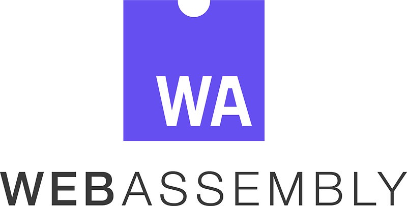
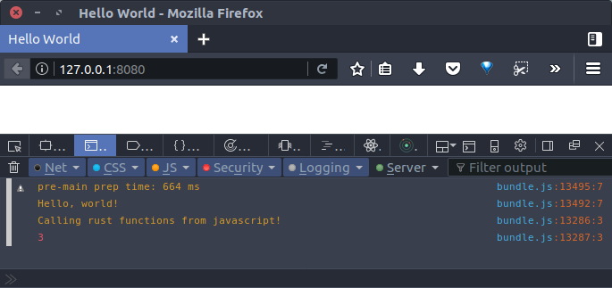

> ## UPDATE!
>
> The Rust Compiler now has native support for compilation to WebAssembly without Emscripten! Most of the info in this post is **no longer relevant**. For an _amazing_ and up-to-date resource on Rust and WebAssembly, check out the [Rust and WebAssembly Book](https://rustwasm.github.io/docs/book/).

I’ve been seeing a lot of really cool [#wasm](https://twitter.com/search?q=%23wasm&src=typd) _(WebAssembly)_ stuff on [Twitter](https://twitter.com/jose_pedro_dias/status/876592025881251840) and [Hacker News](https://news.ycombinator.com/item?id=14341623) lately, but I didn’t know much about what it is exactly, or how to start using it. Because it is so new — only being enabled in Chrome last March — up-to-date guides are few and far between. After struggling through getting something to run, here’s what I’ve learned:

[WebAssembly](http://webassembly.org/) is a _cool new binary format_ and compile target for the web. That means you can compile languages like C, C++, and Rust to .wasm files and execute that code in your browser. In most cases, the resulting code is significantly [faster _and_ smaller](https://hacks.mozilla.org/2017/03/why-webassembly-is-faster-than-asm-js/) than Javascript.

This guide will walk you through setting up Rust, WebAssembly, and Webpack in a typical JS web app. The goal is to be able to execute low-level Rust code in the browser alongside the Javascript you know and love _(or hate)_.

**_Note:_** These technologies are constantly changing. This guide is using:

- webpack 3.0.0
- cargo 0.19.0
- emcc 1.37.13

[Here is the finished project](https://github.com/ianjsikes/rust-wasm-webpack-tutorial). If you run into a problem, let me know with an [issue](https://github.com/ianjsikes/rust-wasm-webpack-tutorial/issues/new) or [PR](https://github.com/ianjsikes/rust-wasm-webpack-tutorial/compare) 😊.



### What you will need

Follow these links to install:

- [Node](https://nodejs.org/en/download/)
- [Rust](https://www.rust-lang.org/en-US/install.html)

### Install the Emscripten Rust compiler

Install the WebAssembly [Emscripten](http://kripken.github.io/emscripten-site/) compile target for Rust:

```bash
$ rustup target add wasm32-unknown-emscripten
```

Install [cmake](https://cmake.org). This varies depending on your platform, choose the option right for you or see the [install page](https://cmake.org/install/) for more options:

```bash
$ brew install cmake                  # MacOS, brew
$ sudo port install cmake             # MacOS, MacPorts
$ sudo apt-get install cmake          # Debian Linux
```

Install the Emscripten SDK. This is going to take a while (_~2 hours for me_).

> Note: If ./emsdk update or ./emsdk install give you errors, it may be that Python3 is your default Python. Try installing Python 2.7 and replacing ./emsdk ... with python2.7 emsdk ...

```bash
$ cd ~
$ wget [https://s3.amazonaws.com/mozilla-games/emscripten/releases/emsdk-portable.tar.gz](https://s3.amazonaws.com/mozilla-games/emscripten/releases/emsdk-portable.tar.gz)
$ tar -xvf emsdk-portable.tar.gz
$ cd emsdk-portable
$ ./emsdk update
$ ./emsdk install sdk-incoming-64bit
```


[_https://xkcd.com/303/_](https://xkcd.com/303/)

Next, we’ll need to add the following directories to our PATH environment variable:

    ~/emsdk-portable
    ~/emsdk-portable/clang/fastcomp/build_incoming_64/bin
    ~/emsdk-portable/emscripten/incoming

Reload the terminal, then run emcc -v to check that the Emscripten compiler is installed.

### Compile and load Rust with Webpack

Let’s create a Rust/Javascript hybrid project:

```bash
cargo new tutorial --bin --vcs none
cd tutorial
npm init        # You can just hit enter for every option
```

We need to install [webpack](https://webpack.js.org/), [http-server](https://www.npmjs.com/package/http-server) to serve our content, and [rust-wasm-loader](https://www.npmjs.com/package/rust-wasm-loader) to compile and load Rust code as .wasm modules.

```bash
npm install --save-dev webpack
http-server rust-wasm-loader
```

Add a few helpful scripts to our package.json:

```json
{
  "scripts": {
    "compile": "webpack --progress",
    "serve": "http-server"
  }
}
```

Create an index.html:

```html
<!DOCTYPE html>
<html>
  <head>
    <title>Hello World</title>
  </head>
  <body>
    <div id="container"></div>
    <script src="build/bundle.js"></script>
  </body>
</html>
```

Create a webpack.config.js:

```js
module.exports = {
  entry: './src/index.js',
  output: {
    filename: 'bundle.js',
    path: __dirname + '/build',
  },
  module: {
    rules: [
      {
        test: /\.rs$/,
        use: {
          loader: 'rust-wasm-loader',
          options: {
            // The path to the webpack output relative to the project root
            path: 'build',
          },
        },
      },
    ],
  },
  // The .wasm 'glue' code generated by Emscripten requires these node builtins,
  // but won't actually use them in a web environment. We tell Webpack to not resolve those
  // require statements since we know we won't need them.
  externals: {
    fs: true,
    path: true,
  },
}
```

Let’s add a function to our src/main.rs that we will call from Javascript:

```rust
fn main() {
    println!("Hello, world!");
}

// Functions that you wish to access from Javascript
// must be marked as no_mangle
#[no_mangle]
pub fn add(a: i32, b: i32) -> i32 {
    return a + b
}
```

Finally, we’ll write some code in src/index.js to load and use the WebAssembly module:

```js
const wasm = require('./main.rs')

wasm.initialize({ noExitRuntime: true }).then(module => {
  // Create a Javascript wrapper around our Rust function
  const add = module.cwrap('add', 'number', ['number', 'number'])

  console.log('Calling rust functions from javascript!')
  console.log(add(1, 2))
})
```

Run these commands to compile and serve the project:

```bash
$ npm run compile
$ npm run serve
```

Navigate the browser to localhost:8080, open the Javascript console, and rest your weary eyes on the glorious output of our WebAssembly compiled Rust code!



_It’s happening!_

**We did it!** [Here is the finished project](https://github.com/ianjsikes/rust-wasm-webpack-tutorial). I hope this tutorial helps you explore the _exciting new world of WebAssembly_. Below are some resources that I’ve found useful. Contact me on [Twitter](https://twitter.com/ianjsikes) if you have any questions/comments/feedback/hate-mail.

### Resources

- [Compiling Rust to your Browser](http://www.hellorust.com/emscripten/)

- [Emscripten Docs](http://kripken.github.io/emscripten-site/docs/index.html)

- [The Path to Rust on the Web](http://asquera.de/blog/2017-04-10/the-path-to-rust-on-the-web/) — This post has more in-depth usage examples.

- [webplatform](https://crates.io/crates/webplatform) — A Rust crate for interacting with the DOM.

- [WebAssembly — MDN](https://developer.mozilla.org/en-US/docs/WebAssembly)

- [Compiling to the web with Rust and emscripten](https://users.rust-lang.org/t/compiling-to-the-web-with-rust-and-emscripten/7627)

- [mrdziuban/rust-emscripten-loader](https://github.com/mrdziuban/rust-emscripten-loader) — [rust-wasm-loader](https://www.npmjs.com/package/rust-wasm-loader) is a fork of this awesome project with small changes to the way modules are initialized. Check this loader out if you want the flexibility of choosing between asm.js and WebAssembly targets.
